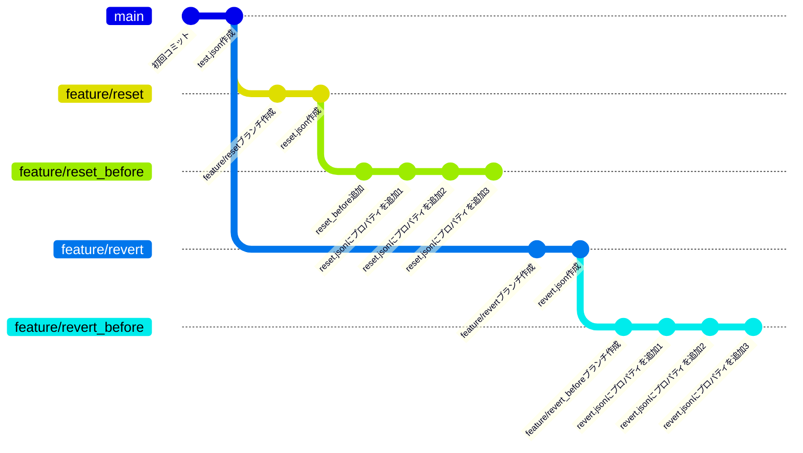

# Git ブランチ構成

```mermaid
gitGraph:
   commit id: "初回コミット"
   commit id: "test.json作成"

   branch feature/reset
   checkout feature/reset
   commit id: "feature/resetブランチ作成"
   commit id: "reset.json作成"

   branch feature/reset_before
   checkout feature/reset_before
   commit id: "reset_before追加"
   commit id: "reset.jsonにプロパティを追加1"
   commit id: "reset.jsonにプロパティを追加2"
   commit id: "reset.jsonにプロパティを追加3"

   checkout main
   branch feature/revert
   checkout feature/revert
   commit id: "feature/revertブランチ作成"
   commit id: "revert.json作成"

   branch feature/revert_before
   checkout feature/revert_before
   commit id: "feature/revert_beforeブランチ作成"
   commit id: "revert.jsonにプロパティを追加1"
   commit id: "revert.jsonにプロパティを追加2"
   commit id: "revert.jsonにプロパティを追加3"
   checkout main


```
