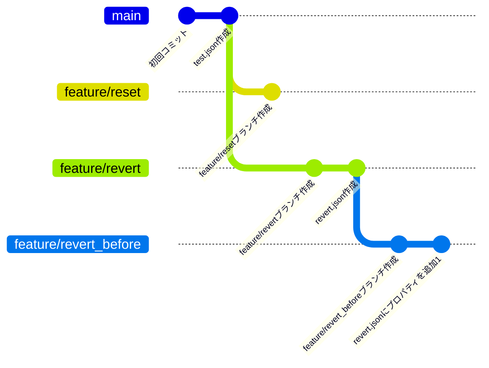

# Git ブランチ構成

以下は、`main`ブランチから`feature/reset`と`feature/revert`に分岐する Git のブランチ構成です。

```mermaid
gitGraph:
   commit id: "初回コミット"
   commit id: "test.json作成"

   branch feature/reset
   checkout feature/reset
   commit id: "feature/resetブランチ作成"
   checkout main

   branch feature/revert
   checkout feature/revert
   commit id: "feature/revertブランチ作成"
   commit id: "revert.json作成"

   branch feature/revert_before
   checkout feature/revert_before
   commit id: "feature/revert_beforeブランチ作成"
   commit id: "revert.jsonにプロパティを追加1"
   checkout main

```
